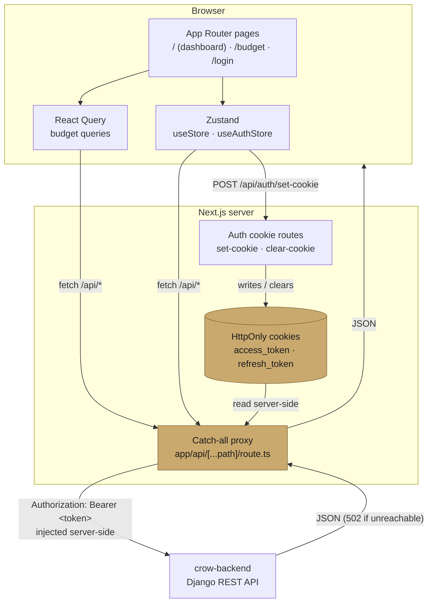

# crow-frontend

Personal expense tracking app built with Next.js. Connects to [crow-backend](../crow-backend) to browse, filter, and manage card payment expenses, with budget tracking and data visualizations.

## Features

- **Expense management** — create, edit, and delete expenses with inline modals
- **Filtering & sorting** — filter by date range, category, subcategory, payment method, and amount; sort by any column
- **Budget tracking** — daily budget allocation with remaining budget and usage percentage
- **Charts** — category breakdown (pie) and monthly trend (bar) powered by Recharts
- **JWT authentication** — login/logout with tokens stored in HttpOnly cookies via a Next.js API proxy; no tokens in `localStorage`
- **Route protection** — `AuthGuard` wraps all pages and redirects unauthenticated users to `/login`

## Tech Stack

| Category | Technology |
|---|---|
| Framework | Next.js 16 (App Router) |
| UI | React 19 + Tailwind CSS v4 |
| Language | TypeScript 5 |
| State | Zustand v5 (expenses, auth) + TanStack React Query v5 (budget) |
| Charts | Recharts v3 |
| Font | Geist (sans + mono) |
| Compiler | React Compiler (babel plugin) |
| Linting | ESLint 9 + eslint-config-next |
| Testing | Vitest 3 |

---

## Architecture

The browser never talks to crow-backend directly and never sees a JWT. Every request goes through the catch-all route handler, which reads the token from an HttpOnly cookie and injects the `Authorization` header server-side.



Tokens live only in HttpOnly cookies, so client-side JavaScript — and therefore any XSS payload — cannot read them. The only client-visible auth state is the `isAuthenticated` boolean in Zustand.

---

## Getting Started

### Prerequisites

- Node.js 20+
- crow-backend running (see [crow-backend README](../crow-backend/README.md))

### 1. Install dependencies

```bash
npm install
```

### 2. Configure environment

Create `.env.local` in the project root:

```env
BACKEND_URL=http://localhost:8000
```

> All `/api/*` requests are proxied to `BACKEND_URL` by the Next.js catch-all route handler at `app/api/[...path]/route.ts`. The default falls back to `http://localhost:8000` if the variable is not set.

### 3. Start the development server

```bash
npm run dev
```

Open [http://localhost:3000](http://localhost:3000). You will be redirected to `/login` if not authenticated.

---

## Available Scripts

| Script | Description |
|---|---|
| `npm run dev` | Start the development server with hot reload |
| `npm run build` | Create a production build |
| `npm run start` | Serve the production build |
| `npm run lint` | Run ESLint |
| `npm run test` | Run the test suite once |
| `npm run test:watch` | Run tests in watch mode |

---

## Testing

Tests run on [Vitest](https://vitest.dev) in a plain Node environment — no DOM, no dev server, and no backend required.

```bash
npm run test          # single run
npm run test:watch    # watch mode
npx vitest run lib    # only the lib/ suites
```

The suite covers the pure logic behind the app rather than rendered markup:

| Suite | Covers |
|---|---|
| `lib/__tests__/proxy.test.ts` | Proxy internals — the `NO_AUTH_PATHS` allowlist, `Authorization` header injection, backend URL building, and the error paths (upstream status passthrough, `204`, `502` when the backend is unreachable) with `fetch` mocked |
| `lib/__tests__/expenseFilters.test.ts` | Filter/query logic — date-range correction, query-string building, sort direction toggling |
| `store/__tests__/useStore.test.ts` | Zustand expense store — fetch/error state, pagination and sort transitions, filter resets, delete fan-out |
| `lib/__tests__/chartUtils.test.ts` | Chart color cycling and KRW formatters |

The proxy and filter logic used to live inline in the route handler and the store. They were extracted into `lib/proxy.ts` and `lib/expenseFilters.ts` so they can be tested without booting Next.js; the route handler and store are thin callers of those helpers.

---

## Project Structure

```
crow-frontend/
├── app/
│   ├── api/
│   │   ├── [...path]/route.ts   # Catch-all proxy → crow-backend
│   │   └── auth/
│   │       ├── set-cookie/      # Stores JWT in HttpOnly cookies
│   │       └── clear-cookie/    # Clears cookies on logout
│   ├── login/page.tsx           # Login page (public)
│   ├── budget/page.tsx          # Budget management (protected)
│   ├── page.tsx                 # Main dashboard (protected)
│   ├── layout.tsx               # Root layout + AuthGuard
│   └── globals.css
├── components/
│   ├── auth/AuthGuard.tsx       # Route protection wrapper
│   ├── charts/
│   │   ├── CategoryPieChart.tsx
│   │   └── MonthlyBarChart.tsx
│   ├── filters/FilterPanel.tsx  # Sidebar filter controls
│   ├── table/
│   │   ├── ExpenseTable.tsx     # Main data table
│   │   ├── ExpenseFormModal.tsx # Create expense modal
│   │   ├── EditExpenseModal.tsx # Edit expense modal
│   │   └── DeleteToast.tsx      # Delete confirmation
│   └── ui/StatsCards.tsx        # Summary stats bar
├── store/
│   ├── useStore.ts              # Expense data, filters, pagination, sorting
│   ├── useAuthStore.ts          # Auth state, login/logout
│   └── __tests__/               # Store transition tests
├── types/index.ts               # Shared TypeScript types
├── lib/
│   ├── proxy.ts                 # Proxy logic: auth allowlist, header injection, fallbacks
│   ├── expenseFilters.ts        # Date-range correction, query-string building, sorting
│   ├── chartUtils.ts            # Chart colors and KRW formatters
│   ├── api/budget.ts            # Budget API calls
│   ├── queries/budgetQueries.ts # React Query hooks for budgets
│   └── __tests__/               # Unit tests for the above
├── vitest.config.ts
└── next.config.ts
```

---

## API Integration

The frontend never calls crow-backend directly. All requests go through the Next.js route handler at `app/api/[...path]/route.ts`, which:

1. Reads the `access_token` from the HttpOnly cookie
2. Attaches `Authorization: Bearer <token>` to the forwarded request — unless the path is on the `NO_AUTH_PATHS` allowlist (`auth/login/`), which must be called without a token
3. Proxies the request to `BACKEND_URL` and returns the response, passing upstream error statuses through unchanged and answering `502 Backend unreachable` if the backend cannot be reached

This keeps JWT tokens out of client-side JavaScript entirely. The handler itself is a thin wrapper — the decisions above live in `lib/proxy.ts` and are unit-tested.

### Auth flow

```
Browser → POST /api/auth/login/   (proxy, no token attached)
        → POST /api/auth/set-cookie/  (stores access + refresh in HttpOnly cookies)
        ← isAuthenticated: true in Zustand

Browser → GET  /api/expenses/expenses/  (proxy, token injected server-side)
        ← expense data

Browser → POST /api/auth/logout/        (proxy)
        → POST /api/auth/clear-cookie/  (deletes cookies)
        ← isAuthenticated: false in Zustand, redirect to /login
```

### State management

| Store | Responsibilities |
|---|---|
| `useStore` | Expenses list, CRUD actions, filters, pagination, sorting, budget summary |
| `useAuthStore` | Current user, `login()`, `logout()`, `fetchMe()` (session restore on page load) |

Filters default to the current month's date range on initial load. Changing any filter triggers an immediate re-fetch.

---

## Deployment

### Vercel (recommended)

1. Push to GitHub and import the repository on [vercel.com](https://vercel.com)
2. Set the environment variable `BACKEND_URL` to your production backend URL
3. Deploy — Vercel handles the Next.js build automatically

### Self-hosted

```bash
npm run build
npm run start          # serves on port 3000 by default
```

Set `BACKEND_URL` and ensure the backend is reachable from the server running Next.js.
